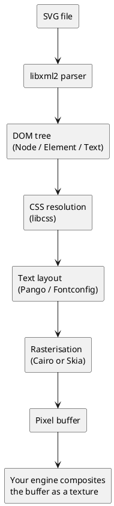

# AeonGUI

[](https://github.com/AeonGames/AeonGUI/actions/workflows/build-windows.yml)
[](https://github.com/AeonGames/AeonGUI/actions/workflows/build-msys2.yml)
[](https://github.com/AeonGames/AeonGUI/actions/workflows/build-ubuntu.yml)
[](https://github.com/AeonGames/AeonGUI/actions/workflows/build-macos.yml)

[](https://aeongames.com)

AeonGUI is a cross-platform C++ GUI and SVG rendering library focused on game UI and interactive applications.
It implements a subset of the SVG DOM and CSS styling pipeline, with a pluggable 2D rendering backend (Cairo or Skia) selected at build time.

Keywords: `C++ GUI`, `SVG renderer`, `game UI`, `cross-platform UI library`, `CMake`, `Cairo`, `Skia`, `Pango`, `HarfBuzz`, `libxml2`.

## Introduction

AeonGUI lets you describe user interfaces with SVG and style them with CSS,
then render them on top of any graphics API your application already uses.
The library parses an SVG document into a DOM tree, resolves CSS styles,
performs text layout, and produces pixel output through a selectable 2D
backend (Cairo or Skia)&mdash;but the rendered result is handed to your
application as a plain pixel buffer, so it can be composited as a texture
in OpenGL, Vulkan, Metal, or any other rendering pipeline.

The project is written in modern C++ (C++20) and built with CMake.
All third-party dependencies are either vendored or fetched automatically,
and the build integrates cleanly with vcpkg on Windows.

## Goals and Design Philosophy

- **SVG as a UI description language.** UI elements are defined in standard
  SVG files and styled with CSS, so designers can work with familiar tools
  (Inkscape, Illustrator, text editors) instead of proprietary formats.
- **Rendering-API agnostic.** The core library never calls OpenGL, Vulkan,
  or Metal directly.  It rasterises into a CPU-side pixel buffer that your
  engine composites however it sees fit.
- **Pluggable 2D backend.** Choose between Cairo and Skia at build time
  via the `AEONGUI_BACKEND` CMake option.  Both backends produce identical
  pixel-buffer output and share the same Pango + HarfBuzz text pipeline.
- **Minimal footprint.** Only the parts of the SVG and DOM specifications
  that are useful for game and application UI are implemented&mdash;no
  scripting engine, no full browser layout model.
- **Embeddable.** The library is designed to be integrated into existing
  game engines and applications, not to be a standalone toolkit.
- **Cross-platform from day one.** CI tests run on Windows (MSVC and
  MSYS2 flavors), Ubuntu, and macOS on every commit.

## What AeonGUI Is *Not*

- **Not a web browser.** There is no JavaScript engine, no full HTML layout,
  and no networking stack.  If you need a browser in your game, look at CEF
  or Ultralight.
- **Not a desktop widget toolkit.** AeonGUI does not provide buttons, scroll
  bars, or dialog boxes out of the box.  It provides the rendering
  primitives you can use to build those things.
- **Not a complete SVG implementation.** Only the subset of SVG 2 that is
  useful for UI rendering is supported (basic shapes, paths, text, images,
  gradients, transforms, groups, defs, SMIL animations).  Filters and
  advanced text features are out of scope for now.
- **Not API-stable yet.** The library is under active development, and
  public interfaces may change between releases.

## Project Status

AeonGUI is under active development and still evolving. APIs and behavior may change.

- Good fit: experimentation, prototyping, engine integration research, SVG-based UI workflows.
- Not yet ideal: long-term API stability guarantees.

## What It Includes

- SVG DOM subset with scene graph traversal and element factory architecture.
- CSS-based styling through `libcss`, including `:hover`, `:active`, and `:focus` pseudo-classes.
- SMIL animation engine: `<animate>`, `<set>`, `<animateTransform>`, and `<animateMotion>` elements
  with time-based and event-based (`click`, `mouseenter`, …) activation.
- Text layout and font shaping via `Pango`, `HarfBuzz`, and `Fontconfig`.
- XML parsing via `libxml2`.
- Raster image support with magic-based format detection. PCX decoding is
  always available with no extra dependencies. PNG and JPEG decoding are
  optional and enabled via `USE_PNG` and `USE_JPEG` respectively (requires
  `libpng` / `libjpeg-turbo`).
- DOM geometry interfaces: `DOMMatrix`, `DOMPoint`, `DOMRect` with full read-only and mutable variants.
- DOM event system: `EventTarget`, `Event`, `EventListener`, `AbortSignal`.
- Mouse input handling: hit-testing via `elementFromPoint`, hover tracking, click and mouseenter/mouseleave dispatch.
- Demo applications for OpenGL, Vulkan, Metal, and Direct3D12.
- Unit tests with GoogleTest/GoogleMock.

## Architecture Overview



The `Window` class ties these stages together: it owns a `Document` (the DOM
tree), a `Canvas` (the rendering surface&mdash;`CairoCanvas` or `SkiaCanvas`
depending on the chosen backend), and a `Location` (the URL of the loaded
SVG).  Your application creates a `Window`, points its `Location` at an SVG
file, calls `Update()` each frame to advance animations, calls `Draw()`, and
reads back pixels via `GetPixels()`.
Mouse input is forwarded through `HandleMouseMove()`, `HandleMouseDown()`,
and `HandleMouseUp()`, which drive CSS pseudo-class state, hit-testing,
and DOM event dispatch for SMIL event-based triggers.

## Platform Support

CI builds currently run on:

- Windows (MSVC)
- Windows (MSYS2: `mingw64`, `ucrt64`, `clang64`)
- Ubuntu
- macOS

## Dependencies

Core dependencies used by the project:

- `cairo` (default backend) **or** `skia` (alternative backend)
- `pango`
- `harfbuzz`
- `fontconfig`
- `libxml2`
- `zlib`
- `libpng` (optional, controlled by `USE_PNG`)
- `libjpeg-turbo` (optional, controlled by `USE_JPEG`)
- `gtest`/`gmock` for tests

For MSVC builds, the repository is configured for `vcpkg` manifests (`vcpkg.json`).

### Backend-specific notes

| Backend | Text rendering pipeline | Package manager availability |
|---------|------------------------|-----------------------------|
| Cairo   | Pango + PangoCairo     | vcpkg, apt, brew, MSYS2 pacman |
| Skia    | Pango + PangoFT2 + HarfBuzz draw API | vcpkg, MSYS2 pacman |

## Quick Start

### 1) Clone

```bash
git clone https://github.com/AeonGames/AeonGUI.git
cd AeonGUI
```

### 2) Configure + Build

#### Windows (MSVC + vcpkg)

```bash
# Cairo backend (default)
cmake -B build -DCMAKE_TOOLCHAIN_FILE="C:/vcpkg/scripts/buildsystems/vcpkg.cmake"
cmake --build build

# Skia backend
cmake -B build-skia -DCMAKE_TOOLCHAIN_FILE="C:/vcpkg/scripts/buildsystems/vcpkg.cmake" -DAEONGUI_BACKEND=Skia
cmake --build build-skia
```

#### Windows (MSYS2 / MinGW)

```bash
# Cairo backend (default)
cmake -G "MSYS Makefiles" -B build -DCMAKE_BUILD_TYPE=Release
cmake --build build

# Skia backend (requires mingw-w64-x86_64-skia or equivalent pacboy)
cmake -G "MSYS Makefiles" -B build-skia -DCMAKE_BUILD_TYPE=Release -DAEONGUI_BACKEND=Skia
cmake --build build-skia
```

#### Linux / macOS

```bash
cmake -B build -DCMAKE_BUILD_TYPE=Release
cmake --build build
```

### 3) Run tests

```bash
ctest --test-dir build --output-on-failure
```

### 4) Run the demo

Demo executables are produced under `build/bin/` (platform naming may vary).
Four rendering backends are included:

| Demo            | Backend | Notes                                     |
|-----------------|---------|-------------------------------------------|
| `OpenGLDemo`    | OpenGL  | Cross-platform, easiest to get started.   |
| `VulkanDemo`    | Vulkan  | Requires the Vulkan SDK.                  |
| `MetalDemo`     | Metal   | macOS only.                               |
| `Direct3D12Demo` | Direct3D12 | Windows only.                         |

## Common CMake Options

- `-DAEONGUI_BACKEND=Cairo|Skia` Select the 2D rendering backend (default: `Cairo`).
- `-DBUILD_UNIT_TESTS=ON|OFF` Build and register unit tests (default: `ON`).
- `-DUSE_ZLIB=ON|OFF` Enable/disable zlib integration.
- `-DUSE_PNG=ON|OFF` Enable/disable PNG decoding.
- `-DUSE_JPEG=ON|OFF` Enable/disable JPEG decoding (`libjpeg-turbo`).
- `-DUSE_CUDA=ON|OFF` Enable optional CUDA code path (unused right now, so it has no effect).
- `-DCMAKE_DISABLE_PRECOMPILE_HEADERS=ON` Disable PCH during iteration.
- `-DCMAKE_BUILD_TYPE=Debug|Release|RelWithDebInfo|MinSizeRel`

Example:

```bash
cmake -B build -DCMAKE_BUILD_TYPE=Debug -DUSE_PNG=ON -DUSE_JPEG=ON
```

## Repository Layout

| Directory             | Contents                                            |
|-----------------------|-----------------------------------------------------|
| `core/`               | Main library implementation (Canvas, Color, Path…). |
| `core/dom/`           | SVG and DOM element classes, SMIL animation elements. |
| `core/parsers/`       | Internal data-type parsers.                         |
| `include/aeongui/`    | Public C++ headers.                                 |
| `include/aeongui/dom/`| Public DOM / SVG header files.                      |
| `css/`                | CSS engine (`libcss`, `libparserutils`, `libwapcaplet`). |
| `demos/OpenGL/`       | OpenGL demo application.                            |
| `demos/Vulkan/`       | Vulkan demo application.                            |
| `demos/Metal/`        | Metal demo application (macOS).                     |
| `demos/Direct3D12/`   | Direct3D12 demo application (Windows).              |
| `images/`             | Sample SVG files and demo assets.                   |
| `tests/`              | Unit tests (GoogleTest / GoogleMock).                |
| `tools/`              | Developer utilities (code generation scripts).      |
| `cmake/`              | CMake helper modules and templates.                 |

## Thread Safety

AeonGUI is **thread-safe** for typical usage patterns.  Internal
synchronisation protects all shared mutable state:

| Component | Protection |
|-----------|-----------|
| `FontDatabase` (singleton) | `std::recursive_mutex` guards all static methods (`Initialize`, `Finalize`, `AddFont*`, `Get*`, `CreateContext`) |
| Element factory (`Construct`, `Destroy`, `Register/Unregister`) | `std::shared_mutex` — concurrent reads, exclusive writes |
| SVG path-data parser (Flex/Bison) | `std::mutex` serialises all `ParsePathData` calls |
| HarfBuzz draw-funcs singleton (Skia backend) | C++11 magic-static initialisation (thread-safe by language guarantee) |
| CSS statics (`unit_len_ctx`, `screen_media`, `select_handler`) | Immutable after static initialisation — safe for concurrent reads |
| Per-thread CSS hint buffer | `thread_local` storage — no contention |

**Guidelines:**

- A single `Document` / `Window` instance must still be accessed from one
  thread at a time (DOM trees are not internally locked).
- Different `Document` / `Window` instances may be used from different
  threads concurrently.
- `FontDatabase::Initialize()` and `Finalize()` are safe to call from any
  thread; concurrent `Initialize()` calls are idempotent.

## Error Handling

The library uses a mixed error-reporting strategy:

| Scenario | Behaviour |
|----------|----------|
| Document load failure (file not found, parse error) | Throws `std::runtime_error` |
| CSS parsing error | Throws `std::runtime_error` |
| Image load (`RasterImage::Load*`) | Returns `bool` (`true` on success) |
| Font database initialisation | Returns `bool`, logs to `stderr` on failure |
| Plugin load (`<script>` element) | Logs to `stderr`, continues silently |
| Unknown SVG element tag | Creates a generic `Element`, logs to `stdout` |

There is no custom exception hierarchy yet.  Callers should be prepared to
catch `std::runtime_error` from `Document` and `Element` construction.

## SVG Feature Support

### Supported elements

| Category | Elements |
|----------|----------|
| Structure | `<svg>`, `<g>`, `<defs>`, `<use>`, `<symbol>` |
| Shapes | `<rect>`, `<circle>`, `<ellipse>`, `<line>`, `<polyline>`, `<polygon>`, `<path>` |
| Text | `<text>`, `<tspan>`, `<textPath>` |
| Paint | `<linearGradient>`, `<stop>` |
| Images | `<image>` (PNG, JPEG, PCX) |
| Animation | `<animate>`, `<set>`, `<animateTransform>`, `<animateMotion>` |
| Scripting | `<script>` (native C plugin API, not JavaScript) |
| Filters | `<filter>`, `<feDropShadow>` |

### Supported CSS / presentation attributes

- `fill`, `stroke`, `stroke-width`, `opacity`, `fill-opacity`, `stroke-opacity`
- `font-family`, `font-size`, `font-weight`, `font-style`
- `transform`, `viewBox`, `preserveAspectRatio`
- Pseudo-classes: `:hover`, `:active`, `:focus`

### Not yet implemented

- `<radialGradient>`
- `<clipPath>`, `<mask>`
- `<pattern>`, `<marker>`
- Filter primitives beyond `<feDropShadow>` (`<feGaussianBlur>`, `<feBlend>`, `<feColorMatrix>`, etc.)
- `stroke-dasharray`, `stroke-linecap`, `stroke-linejoin`
- CSS attribute selectors (`[attr=value]`)
- `<a>` (hyperlinks)

## Notes For New Contributors

- Use CMake out-of-source builds (`-B build`).
- A pre-commit hook is configured by CMake; it validates style and copyright notices.
- If iteration speed matters, disable PCH with `-DCMAKE_DISABLE_PRECOMPILE_HEADERS=ON`.
- CI workflows in `.github/workflows/` are the best reference for known-good dependency sets.

## Developer Environment Tips (Optional)

### Installing Zsh on MSYS2

If you want to use Zsh on MSYS2 with the `powerlevel10k` theme:

```bash
pacman -S zsh
sh -c "$(curl -fsSL https://raw.githubusercontent.com/ohmyzsh/ohmyzsh/master/tools/install.sh)"
```

After installing oh-my-zsh, install `powerlevel10k` with:

```bash
git clone --depth=1 https://github.com/romkatv/powerlevel10k.git ${ZSH_CUSTOM:-$HOME/.oh-my-zsh/custom}/themes/powerlevel10k
sed -i "s/^ZSH_THEME=.*/ZSH_THEME=\"powerlevel10k\/powerlevel10k\"/" ~/.zshrc
```

To make MSYS2 terminals default to zsh, edit the corresponding `.ini` files under `C:\msys64` and add:

```ini
SHELL=/usr/bin/zsh
```

### VS Code shell integration for MSYS2 terminals

If you use MSYS2 `bash` or `zsh` in VS Code, add this to `.bashrc` or `.zshrc`:

```bash
export PATH="$PATH:$(cygpath "$LOCALAPPDATA/Programs/Microsoft VS Code/bin")"
[[ "$TERM_PROGRAM" == "vscode" ]] && . "$(cygpath "$(code --locate-shell-integration-path <zsh|bash>)")"
```

Replace `<zsh|bash>` with the shell you are configuring.

## FAQ

### Does AeonGUI depend on V8/JavaScript?

No. Historical experiments existed, but the current codebase is C++ focused and does not require V8.

### Can I use AeonGUI with my own rendering engine?

Yes. AeonGUI renders into a CPU-side pixel buffer (BGRA), regardless of
whether the Cairo or Skia backend is selected. You can upload that buffer
as a texture in OpenGL, Vulkan, Metal, DirectX, or any other API and
composite it however you like. The demo applications show how to do this
for OpenGL, Vulkan, Metal, and Direct3D12.

### Which parts of SVG are supported?

Basic shapes (`rect`, `circle`, `ellipse`, `line`, `polyline`, `polygon`,
`path`), `text` and `tspan`, `image`, `g`, `defs`, `use`, `linearGradient`,
`radialGradient`, and `svg` root elements. Transforms, CSS styling, and
`viewBox` / `preserveAspectRatio` are supported.

SMIL animation elements are supported: `<animate>` (paint properties,
geometry attributes, and corner-radius path animations), `<set>` (discrete
value changes), `<animateTransform>` (rotate, scale, translate, skewX,
skewY), and `<animateMotion>` (path-based motion with arc-length
interpolation). Animations can be triggered by time or by DOM events such
as `click` and `mouseenter`.

CSS pseudo-classes `:hover`, `:active`, and `:focus` are resolved
dynamically based on mouse input.

Filters, `clip-path`, `mask`, and advanced text features are not yet
implemented.  See the [SVG Feature Support](#svg-feature-support) section
for details.

### How do I generate the API documentation?

Build the `docs` target:

```bash
cmake --build build --target docs
```

The HTML documentation is generated in `build/docs/AeonGUI/`.

## Links

- **Source code:** <https://github.com/AeonGames/AeonGUI>
- **Issue tracker:** <https://github.com/AeonGames/AeonGUI/issues>
- **Pull requests:** <https://github.com/AeonGames/AeonGUI/pulls>
- **CI workflows:** <https://github.com/AeonGames/AeonGUI/actions>

## License

AeonGUI is released under the [Apache License 2.0](http://www.apache.org/licenses/LICENSE-2.0).

```
Copyright (C) 2019-2026 Rodrigo Jose Hernandez Cordoba

Licensed under the Apache License, Version 2.0 (the "License");
you may not use this file except in compliance with the License.
You may obtain a copy of the License at

    http://www.apache.org/licenses/LICENSE-2.0

Unless required by applicable law or agreed to in writing, software
distributed under the License is distributed on an "AS IS" BASIS,
WITHOUT WARRANTIES OR CONDITIONS OF ANY KIND, either express or implied.
See the License for the specific language governing permissions and
limitations under the License.
```

The Aeon Games logo is a trademark and is **not** covered by Apache 2.0, it may not be used without express permission.

## Authors

- Rodrigo Hernandez (`kwizatz` at `aeongames` dot `com`)
